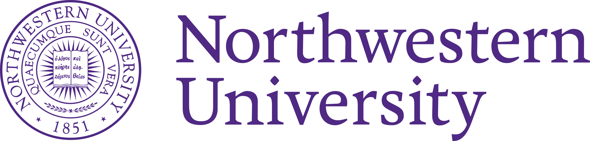

## Hi, I'm Zhenglin! 👋 

  

  Master of Science in  
  <b> Machine Learning and Data Science (MLDS) </b> 
  at Northwestern University  
  Personal Web: https://zhenglin.netlify.app/

  <b>Data Science · Statistical Modeling · Machine Learning · AI Agents</b>

---
  
### 🔍 Interests
- 🤖 Machine Learning & Applied AI
- 🖥️ Statistical Modeling
- 📈 Data Visualization 

---

### 🛠 Tech Stack

  

**Languages:**
`Python` `R` `Java` `MATLAB` `SQL` `HTML` `CSS` `JavaScript` `LaTeX`

**Data Analytics & Visualization:**
`Pandas` `NumPy` `SciPy` `MatplotLib` `Seaborn` `Excel`

**Machine Learning:**
`Scikit-Learn` `PyTorch` `TensorFlow`

**Tools:**
`Git` `GitHub` `VS Code` `RStudio` `PyCharm` `WebStorm` `MySQL` `SQLite` `MongoDB` `Overleaf`

---

### 📌 Highlights

- Built **end-to-end analytics** workflows for real-world datasets  
- Applied **ML models** to prediction, classification, and decision support  
- Combined **mathematical reasoning** with practical implementation in research and industry settings  

---

### 🎯 Current Goals

I am currently seeking opportunities to grow in:
- **Data Science**
- **Machine Learning Engineering**
- **Applied AI Research**
- **Graduate-level research and collaboration**

---

### 📫 Contact
**Email: zhenglin0619@gmail.com**  
**Linkedin: www.linkedin.com/in/zhenglin-wang**  
**Personal Website: https://zhenglin.netlify.app/**

<h3 align="center">
  <b>Thanks for visiting my profile!</b>
</h3>

  I’m always excited to connect, collaborate, and learn.

